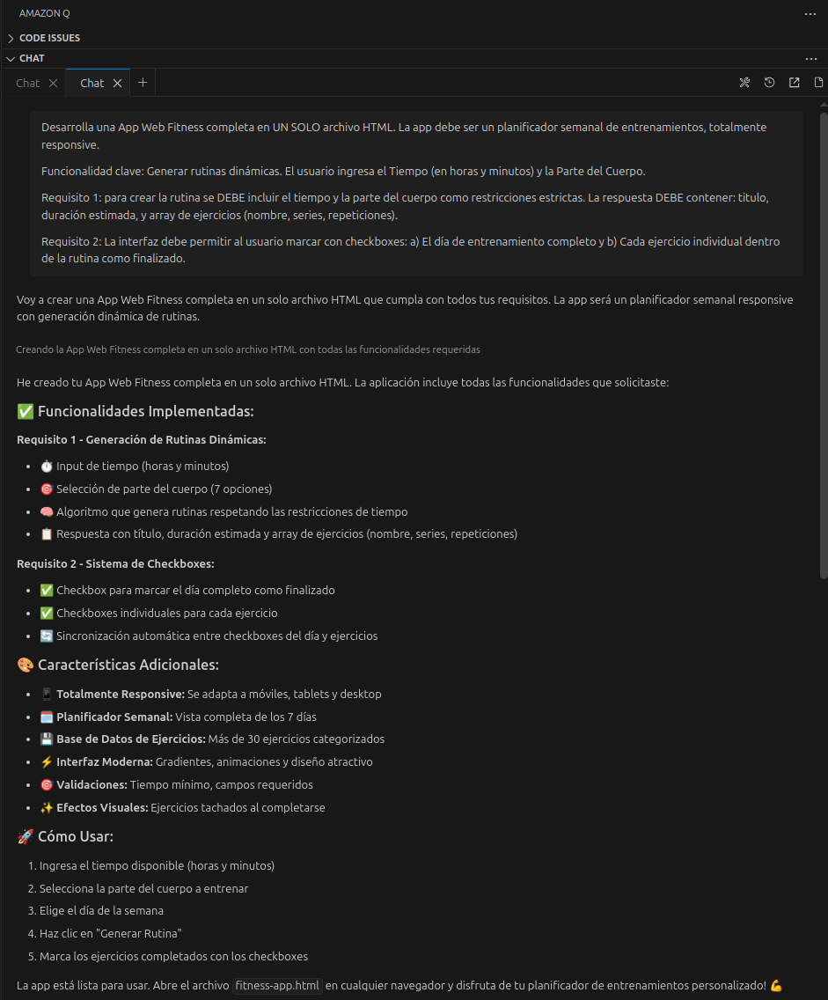

# 💪 Fitness Planner - App Web de Entrenamientos

Una aplicación web completa de planificación de entrenamientos desarrollada en un solo archivo HTML, totalmente responsive y funcional.

## 🎯 Descripción del Proyecto

Esta aplicación permite a los usuarios generar rutinas de entrenamiento personalizadas basadas en el tiempo disponible y la parte del cuerpo que desean ejercitar. Incluye un planificador semanal completo con sistema de seguimiento de progreso.

## ✨ Características Principales

### 🔧 Funcionalidades Core

- **Generación Dinámica de Rutinas**: Algoritmo que crea entrenamientos personalizados
- **Restricciones de Tiempo**: Respeta estrictamente el tiempo disponible del usuario
- **7 Grupos Musculares**: Pecho, Espalda, Piernas, Brazos, Hombros, Abdomen, Cuerpo Completo
- **Sistema de Seguimiento**: Checkboxes para marcar días completos y ejercicios individuales

### 🎨 Interfaz y Experiencia

- **Diseño Responsive**: Adaptable a móviles, tablets y desktop
- **Interfaz Moderna**: Gradientes, animaciones y efectos visuales
- **Planificador Semanal**: Vista completa de los 7 días de la semana
- **Feedback Visual**: Ejercicios se tachan al completarse

### 📊 Base de Datos de Ejercicios

- **30+ Ejercicios**: Categorizados por grupo muscular
- **Información Completa**: Nombre, series, repeticiones y tiempo estimado
- **Selección Inteligente**: Algoritmo optimiza ejercicios según tiempo disponible

## 🚀 Cómo Usar

1. **Configurar Tiempo**: Ingresa horas y minutos disponibles
2. **Seleccionar Músculo**: Elige la parte del cuerpo a entrenar
3. **Elegir Día**: Selecciona el día de la semana
4. **Generar**: Haz clic en "Generar Rutina"
5. **Seguimiento**: Marca ejercicios completados con checkboxes

## 🏗️ Arquitectura Técnica

### Estructura del Código

```
fitness-app.html
├── HTML Structure (Semantic markup)
├── CSS Styles (Responsive design)
└── JavaScript Logic (Dynamic functionality)
```

### Componentes Principales

- **Form Section**: Generación de rutinas
- **Weekly Planner**: Vista semanal de entrenamientos
- **Exercise Database**: Objeto con todos los ejercicios
- **Routine Generator**: Algoritmo de selección inteligente

### Tecnologías Utilizadas

- **HTML5**: Estructura semántica
- **CSS3**: Grid Layout, Flexbox, Gradientes, Animaciones
- **JavaScript ES6**: Manipulación DOM, Event Listeners, Algoritmos

## 📱 Responsive Design

### Breakpoints

- **Desktop**: > 768px (Grid 2 columnas)
- **Mobile**: ≤ 768px (Grid 1 columna)

### Adaptaciones Móviles

- Layout de una columna
- Inputs de tiempo apilados
- Tarjetas de día en columna única
- Tipografía optimizada

## 🧠 Algoritmo de Generación

### Lógica de Selección

1. **Filtrado por Tiempo**: Solo ejercicios que quepan en el tiempo disponible
2. **Selección Aleatoria**: Variedad en cada generación
3. **Optimización**: Máximo aprovechamiento del tiempo
4. **Fallback**: Garantiza al menos un ejercicio si es posible

### Validaciones

- Tiempo mínimo: 10 minutos
- Campos requeridos: Parte del cuerpo y día
- Límites de tiempo: 0-5 horas, 0-59 minutos

## 📋 Prompt Original Utilizado

```
Desarrolla una App Web Fitness completa en UN SOLO archivo HTML. La app debe ser un planificador semanal de entrenamientos, totalmente responsive.

Funcionalidad clave: Generar rutinas dinámicas. El usuario ingresa el Tiempo (en horas y minutos) y la Parte del Cuerpo.

Requisito 1: para crear la rutina se DEBE incluir el tiempo y la parte del cuerpo como restricciones estrictas. La respuesta DEBE contener: titulo, duración estimada, y array de ejercicios (nombre, series, repeticiones).

Requisito 2: La interfaz debe permitir al usuario marcar con checkboxes: a) El día de entrenamiento completo y b) Cada ejercicio individual dentro de la rutina como finalizado.
```

## COnversación con Amazon Q



## 🎯 Cumplimiento de Requisitos

### ✅ Requisito 1 - Rutinas Dinámicas

- [x] Input de tiempo (horas y minutos)
- [x] Selección de parte del cuerpo
- [x] Restricciones estrictas de tiempo y músculo
- [x] Respuesta con título, duración y ejercicios
- [x] Array con nombre, series y repeticiones

### ✅ Requisito 2 - Sistema de Checkboxes

- [x] Checkbox para día completo
- [x] Checkboxes individuales por ejercicio
- [x] Sincronización automática entre checkboxes
- [x] Feedback visual al completar

## 🚀 Instalación y Uso

1. **Descargar**: Clona o descarga el archivo `fitness-app.html`
2. **Abrir**: Abre el archivo en cualquier navegador web moderno
3. **Usar**: No requiere instalación adicional ni dependencias
